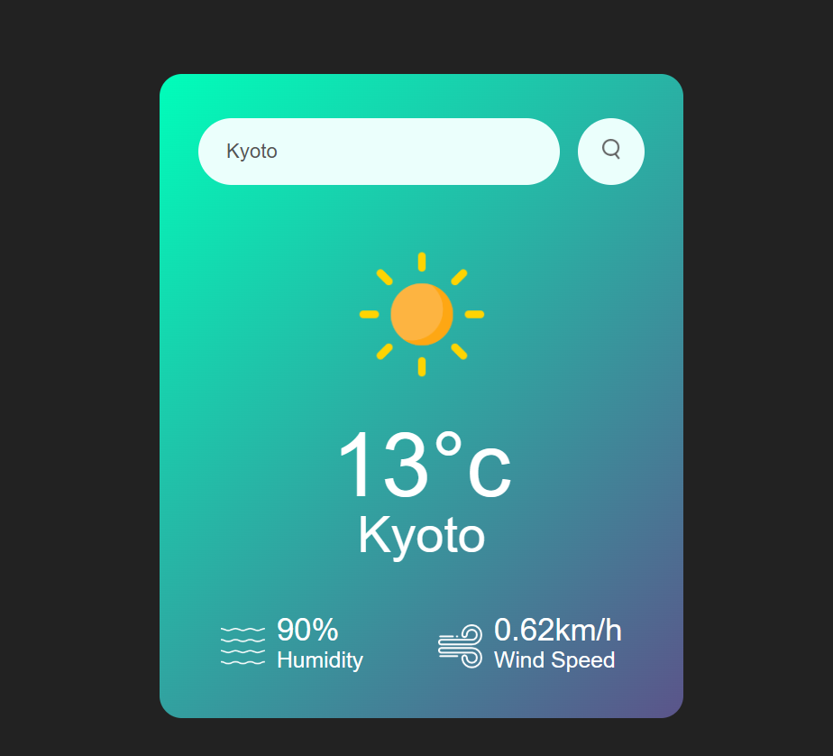

# Weather-App
JS mini project
# 🌦️ Weature - Weather App

A simple weather web app built with vanilla HTML, CSS, and JavaScript.
Fetches real-time weather data using the OpenWeatherMap API.

> 📺 Built by following a YouTube tutorial — focus was on learning API calls, async/await, and DOM manipulation.

---

## 🚀 Features

- Search weather by city name
- Displays temperature, humidity, and wind speed
- Dynamic weather icons based on current conditions
- Error handling for invalid city names

---

## 🛠️ Tech Stack

- HTML5
- CSS3 (Flexbox)
- Vanilla JavaScript (fetch, async/await)
- [OpenWeatherMap API](https://openweathermap.org/api)

---

## 📸 Preview

<!-- Add a screenshot here -->

---

## 🐛 Bugs I Fixed

While following the tutorial, I caught and fixed these bugs:

- `==` (comparison) used instead of `=` (assignment) for weather icon `src` — icons weren't updating
- 404 error logic was inverted — error message and weather card were showing/hiding backwards

---

## 📂 Project Structure

weature-app/
├── images/
│   ├── clear.png
│   ├── clouds.png
│   ├── drizzle.png
│   ├── humidity.png
│   ├── mist.png
│   ├── rain.png
│   ├── search.png
│   ├── snow.png
│   └── wind.png
├── index.html
└── style.css

---

## 🙏 Credits

- Tutorial: GreatStack
- Weather data: [OpenWeatherMap](https://openweathermap.org/)
